# 🚀 Maikol Camareno Peña | Full-Stack Developer & Software Architect

## 🌟 Sobre mí
Soy un apasionado ingeniero de software con experiencia en desarrollo Full-Stack y arquitectura de software. Actualmente, estoy aplicando mis habilidades en Coopeguanacaste R.L., donde combino mi experiencia técnica con mi visión estratégica para crear soluciones innovadoras y escalables.

# 💻 Stack Tecnológico:

```mermaid
graph TD
    classDef default fill:#f9f9f9,stroke:#333,stroke-width:2px;
    classDef highlight fill:#ff9999,stroke:#ff3333,stroke-width:4px;
    classDef category fill:#ffffcc,stroke:#cccc00,stroke-width:3px;
    classDef tech fill:#e6f3ff,stroke:#4da6ff,stroke-width:2px;

    A[Tech Stack]:::highlight
    A --> B[Lenguajes]:::category
    A --> C[Frontend]:::category
    A --> D[Backend]:::category
    A --> E[Bases de Datos]:::category
    A --> F[DevOps]:::category
    A --> G[Herramientas]:::category

    B --> B1[JavaScript/TypeScript]:::tech
    B --> B2[Python]:::tech
    B --> B3[C#]:::tech
    B --> B4[C/C++]:::tech

    C --> C1[React]:::tech
    C --> C2[HTML5/CSS3]:::tech
    C --> C3[SASS]:::tech
    C --> C4[Bootstrap]:::tech

    D --> D1[Node.js]:::tech
    D --> D2[.NET]:::tech
    D --> D3[Express.js]:::tech

    E --> E1[SQL Server]:::tech
    E --> E2[MySQL]:::tech
    E --> E3[PostgreSQL]:::tech
    E --> E4[Cassandra]:::tech

    F --> F1[Docker]:::tech
    F --> F2[Jenkins]:::tech
    F --> F3[Azure]:::tech
    F --> F4[Google Cloud]:::tech

    G --> G1[Git]:::tech
    G --> G2[Jira]:::tech
    G --> G3[Postman]:::tech
    G --> G4[Swagger]:::tech

    linkStyle default stroke-width:2px,fill:none,stroke:gray;

    style A font-size:20px;
    style B font-size:18px;
    style C font-size:18px;
    style D font-size:18px;
    style E font-size:18px;
    style F font-size:18px;
    style G font-size:18px;
```
                                          

## 🏆 Logros y Estadísticas
 
 

## 💡 Proyectos Destacados
1. **Sistema de Gestión Energética** - Arquitectura y desarrollo de una plataforma integral para optimizar el consumo energético.
2. **API de Microservicios** - Diseño e implementación de una arquitectura de microservicios escalable para servicios financieros.
3. **Dashboard de Análisis en Tiempo Real** - Desarrollo de un panel de control interactivo utilizando React y D3.js para visualización de datos en tiempo real.

## 🌐 Conéctate conmigo
    

## 📚 Aprendizaje Continuo
"La única habilidad competitiva a largo plazo es la capacidad de aprender." - Seymour Papert

Estoy constantemente explorando nuevas tecnologías y metodologías para mantenerme a la vanguardia en el mundo del desarrollo de software. ¡Siempre estoy abierto a colaboraciones y nuevos desafíos!

### 🔝 Top Contributed Repo

---

  

<!-- Proudly created with GPRM ( https://gprm.itsvg.in ) -->
